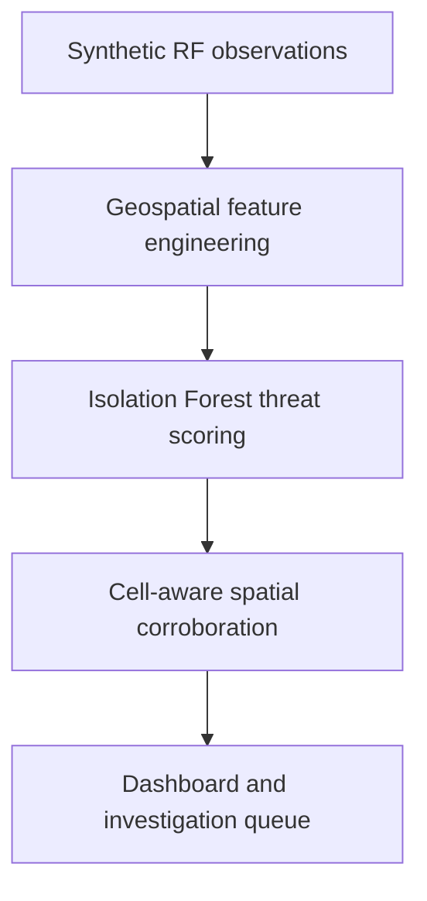

# CellDefense GeoAI

CellDefense GeoAI is a GeoAI decision-support prototype that detects, maps
and prioritises suspicious base-station measurement anomalies for further
technical investigation.

The current prototype uses reproducible synthetic RF drive-test observations
within a fictional Cyberjaya study area. It does **not** claim to confirm an
IMSI catcher or rogue base station.

## Problem

Telecommunications monitoring teams may encounter unusual radio observations
caused by legitimate network changes, equipment faults, measurement errors,
interference or suspicious transmitters.

Reviewing every unusual reading individually produces unnecessary workload.
A more useful system should distinguish isolated unusual readings from
geographically corroborated anomalies and explain why an area deserves
further investigation.

## Primary users

- MCMC spectrum-monitoring and enforcement personnel;
- mobile-network security and operations teams;
- RF engineers; and
- authorised field-investigation personnel.

## Current MVP

The working prototype:

1. Generates reproducible synthetic LTE and NR drive-test observations.
2. Injects a cloned-cell-style geographic inconsistency scenario.
3. Calculates radio and geospatial consistency features.
4. Trains an unsupervised Isolation Forest using baseline observations only.
5. Produces a threat score from 0 to 100 for every observation.
6. Applies cell-aware DBSCAN spatial corroboration.
7. Separates isolated point alerts from investigation-worthy clusters.
8. Generates human-readable feature diagnostics.
9. Displays results in static maps and an interactive Streamlit dashboard.

## Implemented detection scope

The current detector analyses:

- whether the reported cell exists in the reference inventory;
- received-signal deviation from a simplified propagation expectation;
- strong signals occurring far from the reported cell location;
- unusually low neighbour-cell counts;
- handover-event behaviour; and
- spatial density among alerts reporting the same cell identity.

The current synthetic anomaly reports the identity of `cell-001` approximately
4.85 kilometres from its fictional reference location while producing a
signal much stronger than expected at that distance.

## Architecture



### Key GeoAI operations

| Stage | Method | Output |
| --- | --- | --- |
| Geographic context | WGS 84 coordinates within the Cyberjaya-area bounding box | Geolocated drive-test observations |
| Distance analysis | Haversine distance to the reported reference cell | Distance in metres |
| Propagation comparison | Simplified log-distance signal model | Expected RSRP and signal residual |
| Anomaly detection | Isolation Forest trained on independent baseline data | Point-level prediction and threat score |
| Spatial corroboration | DBSCAN in WGS 84 / UTM zone 47N | Dense investigation clusters and spatial noise |
| Cell-identity control | DBSCAN applied independently per reported cell | Different cells cannot contaminate the same cluster |
| Explainability | Cluster medians compared with the normal 1st–99th percentile range | Human-readable threat evidence |

## Synthetic study area and data

| Property | Current value |
| --- | --- |
| Study context | Cyberjaya-area fictional pilot zone |
| Geographic bounds | Latitude 2.89–2.97, longitude 101.62–101.70 |
| Synthetic routes | 3 |
| Synthetic reference stations | 8 |
| Observations | 1,800 |
| Sampling interval | 1 second |
| Synthetic anomaly observations | 90 |
| Anomaly proportion | 5% |
| Coordinate reference system | WGS 84 (`EPSG:4326`) |
| Projected clustering system | WGS 84 / UTM zone 47N (`EPSG:32647`) |

All route and base-station locations are fictional. They do not represent a
verified telecommunications-infrastructure inventory.

See [the dataset card](docs/dataset_card.md) and
[the data dictionary](docs/data_dictionary.md) for full details.

## Current synthetic benchmark

| Metric | Result |
| --- | ---: |
| Point-level precision | 0.8654 |
| Point-level recall | 1.0000 |
| Point-level F1 score | 0.9278 |
| Point-level false-positive rate | 0.0082 |
| True-positive point alerts | 90 |
| False-positive point alerts | 14 |
| Corroborated investigation clusters | 1 |
| Alerts in the investigation cluster | 90 |
| True anomaly fraction in the investigation cluster | 1.0000 |
| Isolated alerts not escalated | 14 |

These results apply only to the controlled synthetic scenario. They do not
establish expected real-world performance.

## Installation

The project is currently developed with Python 3.13.

Create and activate a virtual environment in Windows PowerShell:

```powershell
py -3.13 -m venv .venv
.\.venv\Scripts\Activate.ps1
```

Install the dependencies and local package:

```powershell
python -m pip install --upgrade pip
python -m pip install -r requirements.txt
python -m pip install -e .
```

## Run the complete pipeline

From the project root, run:

```powershell
python scripts/run_pipeline.py
```

This command:

1. Generates the baseline dataset.
2. Generates the cloned-cell-style scenario.
3. Trains and evaluates the anomaly detector.
4. Scores the scenario observations.
5. Performs cell-aware spatial clustering.
6. Generates cluster diagnostics.
7. Rebuilds the static maps.

## Launch the dashboard

After running the pipeline:

```powershell
python -m streamlit run dashboard/app.py
```

The dashboard provides:

- an interactive investigation map;
- layer controls for routes, stations, isolated alerts and priority areas;
- an investigation-priority queue;
- human-readable threat evidence;
- synthetic benchmark metrics; and
- governance and limitation statements.

## Run the tests

```powershell
python -m pytest
```

## Generated outputs

| Output | Path |
| --- | --- |
| Baseline observations | `data/synthetic/baseline_observations.parquet` |
| Scenario observations | `data/synthetic/scenario_observations.parquet` |
| Trained detector | `data/processed/anomaly_detector.joblib` |
| Scored observations | `data/processed/scored_observations.parquet` |
| Clustered observations | `data/processed/clustered_observations.parquet` |
| Cluster summary | `data/processed/alert_cluster_summary.csv` |
| Cluster diagnostics | `data/processed/cluster_feature_diagnostics.csv` |
| Evaluation metrics | `data/processed/evaluation_metrics.json` |
| Baseline map | `docs/baseline_network_map.png` |
| Scenario map | `docs/cloned_cell_scenario_map.png` |
| Detection-results map | `docs/detection_results_map.png` |

Generated datasets and trained artefacts are excluded from Git because they
can be reproduced by running the pipeline.

## Project structure

```text
CellDefense-GeoAI/
├── dashboard/
│   └── app.py
├── data/
│   ├── processed/
│   ├── raw/
│   └── synthetic/
├── docs/
│   ├── baseline_network_map.png
│   ├── cloned_cell_scenario_map.png
│   ├── data_dictionary.md
│   ├── dataset_card.md
│   └── detection_results_map.png
├── scripts/
│   ├── cluster_alerts.py
│   ├── diagnose_clusters.py
│   ├── generate_baseline.py
│   ├── generate_scenario_dataset.py
│   ├── plot_baseline.py
│   ├── plot_detection_results.py
│   ├── plot_scenario.py
│   ├── run_pipeline.py
│   └── train_detector.py
├── src/
│   └── celldefense/
├── tests/
├── pyproject.toml
├── README.md
└── requirements.txt
```

## Non-goals

The prototype does not:

- confirm the presence of an IMSI catcher;
- attribute malicious intent;
- identify the operator of a suspicious transmitter;
- detect RF jamming;
- intercept communications;
- transmit, spoof, jam or interfere with cellular signals;
- collect subscriber or device identifiers; or
- replace regulator, operator or RF-engineering verification.

A high threat score means an observation is unusual relative to the synthetic
baseline. A corroborated cluster means an area should be prioritised for
authorised investigation. Neither result is proof of malicious
infrastructure.

## Ethics and privacy

The current prototype stores no:

- IMSI;
- IMEI;
- MSISDN;
- subscriber identity;
- communications content;
- payload;
- browsing history; or
- real device identifier.

Any future real-world measurements must use authorised passive procedures,
calibrated equipment, data minimisation, access controls and defined retention
periods. Deployment would also require operator or regulator validation and
review against applicable Malaysian privacy, telecommunications and
cybersecurity requirements.

## Limitations

- All current measurements and infrastructure are synthetic.
- Only one cloned-cell-style geographic inconsistency is evaluated.
- The propagation model does not fully represent terrain, buildings, antenna
  patterns, beamforming or network optimisation.
- The reference inventory is complete and clean, unlike many real-world
  databases.
- Spatial corroboration currently uses distance and reported cell identity;
  additional temporal separation should be evaluated in future work.
- Road-network response routing is a planned supporting feature and is not
  part of the current implemented MVP.

## Future validation

A responsible next stage would require:

1. Authorised passive drive-test measurements from calibrated equipment.
2. A verified operator or regulator reference-cell inventory.
3. Controlled laboratory anomalies.
4. Independent geographic and temporal validation areas.
5. False-positive review by RF and cybersecurity specialists.
6. Data-protection, access-control and retention assessment.
7. Supporting road-network routing after the investigation areas are
   validated.
