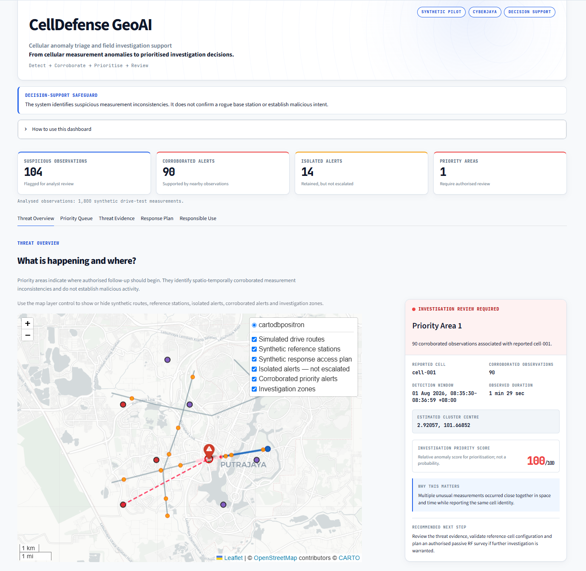
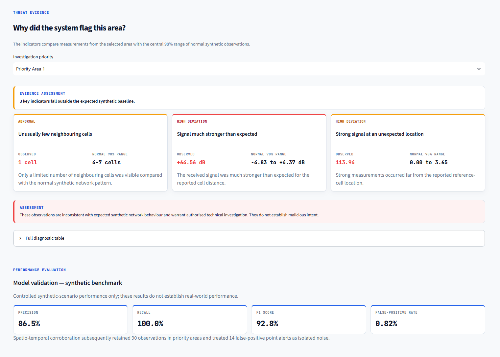
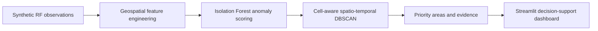

# CellDefense GeoAI

CellDefense GeoAI is a GeoAI decision-support prototype that detects, maps,
explains and prioritises suspicious base-station measurement anomalies for
authorised technical investigation.

The completed MVP uses reproducible synthetic RF drive-test observations
within a fictional Cyberjaya study area. It does **not** claim to confirm an
IMSI catcher, rogue base station or malicious transmitter.

## Project status

The current MVP includes:

- reproducible synthetic LTE and NR drive-test data;
- a cloned-cell-style geographic inconsistency scenario;
- geospatial and radio-feature engineering;
- unsupervised point-level anomaly detection;
- cell-aware spatio-temporal alert corroboration;
- explainable investigation-priority scoring;
- a ranked investigation queue;
- supporting fictional access planning;
- static analytical maps;
- a responsive Streamlit decision-support dashboard; and
- 46 passing automated tests.

## Problem

Telecommunications monitoring teams may encounter unusual radio observations
caused by legitimate network changes, equipment faults, measurement errors,
interference or suspicious transmitters.

Reviewing every unusual reading individually creates unnecessary operational
workload and false-alert fatigue. Isolated alerts may not justify an immediate
field response, while multiple related observations occurring close together
in space and time may warrant further investigation.

CellDefense GeoAI addresses this problem by transforming noisy point alerts
into explainable, spatially corroborated investigation areas.

## Primary users

The intended users are:

- MCMC spectrum-monitoring and enforcement personnel;
- mobile-network security and operations teams;
- mobile-network RF engineers;
- GeoAI analysts; and
- authorised field-investigation personnel.

## What the prototype does

The pipeline:

1. Generates reproducible synthetic LTE and NR drive-test observations.
2. Injects a cloned-cell-style geographic inconsistency scenario.
3. Calculates radio and geospatial consistency features.
4. Trains an unsupervised Isolation Forest using independent baseline
   observations.
5. Produces a normalised investigation-priority score from 0 to 100 for each
   observation.
6. Applies cell-aware spatio-temporal DBSCAN corroboration.
7. Separates isolated point alerts from dense investigation clusters.
8. Ranks corroborated areas for authorised human review.
9. Produces human-readable evidence explaining why an area was prioritised.
10. Plans a supporting access path along the nearest fictional drive route.
11. Presents the resulting maps, cases, evidence and safeguards in an
    interactive dashboard.

An investigation-priority score is a relative anomaly-ranking value. It is
**not** a calibrated probability and is **not** proof of malicious activity.

## Dashboard

The Streamlit dashboard translates the GeoAI pipeline into five
decision-support views:

1. **Threat Overview** — maps alerts, reference stations, synthetic routes
   and prioritised investigation areas.
2. **Priority Queue** — presents genuine corroborated cases in investigation
   order.
3. **Threat Evidence** — compares suspicious measurements with the normal
   synthetic baseline.
4. **Response Plan** — demonstrates a supporting access path using fictional
   routes.
5. **Responsible Use** — documents privacy controls, interpretation
   boundaries and deployment limitations.

### Threat Overview

The overview distinguishes isolated point alerts from spatio-temporally
corroborated observations and shows the highest-priority area beside the live
map.

<!-- markdownlint-disable MD033 -->
<p align="center">
  
</p>
<!-- markdownlint-enable MD033 -->

### Explainable threat evidence

Each priority area includes human-readable reasons. The current scenario is
prioritised because multiple independent measurements fall outside the central
98% range of the normal synthetic baseline.

<!-- markdownlint-disable MD033 -->
<p align="center">
  
</p>
<!-- markdownlint-enable MD033 -->

## Architecture



## GeoAI and machine-learning methodology

### Feature engineering

The detector analyses:

- whether the reported cell exists in the synthetic reference inventory;
- distance between the observation and reported reference cell;
- expected RSRP using a simplified log-distance propagation model;
- residual between measured and expected RSRP;
- signal-distance inconsistency;
- unusually low neighbour-cell counts; and
- handover-event behaviour.

The current cloned-cell-style scenario reports the identity of `cell-001`
approximately 4.85 kilometres from its fictional reference location while
producing a signal much stronger than expected at that distance.

### Point-level anomaly detection

An unsupervised Isolation Forest is trained only on independent synthetic
baseline observations. It learns the baseline feature distribution and assigns
an anomaly score to each scenario observation.

The anomaly score is normalised into an investigation-priority score from
0 to 100 for human triage.

### Spatio-temporal corroboration

Point alerts are corroborated using a cell-aware DBSCAN process with:

- a maximum spatial separation of 200 metres;
- a maximum temporal separation of 120 seconds;
- a minimum of five observations; and
- grouping by reported cell identity.

Applying DBSCAN independently for each reported cell prevents observations
reporting different identities from being merged into the same investigation
cluster.

### Site prioritisation and explainability

Corroborated clusters are ranked by:

1. maximum investigation-priority score; and
2. number of supporting observations.

For each cluster, feature medians are compared with the 1st–99th percentile
range of normal synthetic measurements. These comparisons generate
human-readable evidence for authorised reviewers.

### Supporting access planning

The prototype selects the geographically nearest fictional drive route,
projects an access point onto it and minimises travel from either fictional
route endpoint.

This feature is a supporting demonstration only. It is not a verified
road-network route and must not be used for navigation, dispatch or
deployment.

## Key geospatial operations

| Stage | Method | Output |
| --- | --- | --- |
| Geographic context | WGS 84 coordinates within a fictional Cyberjaya-area bounding box | Geolocated synthetic observations |
| Distance analysis | Haversine distance to the reported reference cell | Distance in metres |
| Propagation comparison | Simplified log-distance signal model | Expected RSRP and signal residual |
| Anomaly detection | Isolation Forest trained on independent baseline data | Point-level anomaly prediction and priority score |
| Spatio-temporal corroboration | Cell-aware DBSCAN using projected UTM coordinates and temporal constraints | Dense investigation clusters and isolated alerts |
| Cell-identity separation | Clustering performed independently for each reported cell | Prevention of cross-cell cluster contamination |
| Site prioritisation | Maximum score followed by supporting-observation count | Transparent investigation queue |
| Explainability | Cluster medians compared with normal 1st–99th percentile ranges | Human-readable evidence |
| Supporting access planning | Nearest fictional route with endpoint-distance minimisation | Synthetic staging point, access point and distance |

## Synthetic study area and data

| Property | Current value |
| --- | ---: |
| Study context | Fictional Cyberjaya-area pilot |
| Geographic bounds | Latitude 2.89–2.97, longitude 101.62–101.70 |
| Approximate area | 8 km × 8 km |
| Synthetic drive routes | 3 |
| Synthetic reference stations | 8 |
| Total observations | 1,800 |
| Sampling interval | 1 second |
| Synthetic anomaly observations | 90 |
| Synthetic anomaly proportion | 5% |
| Geographic coordinate system | WGS 84 (`EPSG:4326`) |
| Projected analysis system | WGS 84 / UTM zone 47N (`EPSG:32647`) |

The primary observation variables include:

- latitude and longitude;
- timestamp;
- serving-cell identity;
- radio access technology;
- PCI and ARFCN;
- RSRP;
- RSRQ;
- SINR;
- neighbour-cell count; and
- handover-event status.

All routes, stations and observations are fictional. They do not represent a
verified telecommunications-infrastructure inventory.

For detailed documentation, see:

- [Dataset card](docs/dataset_card.md)
- [Data dictionary](docs/data_dictionary.md)
- [Project brief](docs/project_brief.md)

## Current synthetic benchmark

The controlled scenario contains 90 synthetic anomaly observations and 1,710
baseline observations.

### Point-level results

| Metric | Result |
| --- | ---: |
| Precision | 86.54% |
| Recall | 100.00% |
| F1 score | 92.78% |
| False-positive rate | 0.82% |
| True-positive point alerts | 90 |
| False-positive point alerts | 14 |
| True-negative observations | 1,696 |
| False-negative observations | 0 |

### Corroboration results

| Result | Value |
| --- | ---: |
| Point alerts before corroboration | 104 |
| Corroborated observations | 90 |
| Isolated alerts not escalated | 14 |
| Investigation clusters | 1 |
| Observations in Priority Area 1 | 90 |
| Synthetic anomaly fraction in Priority Area 1 | 100% |

In this controlled scenario, spatio-temporal corroboration retained all 90
synthetic anomaly observations in one investigation area and treated all 14
false-positive point alerts as isolated observations.

These results apply only to the reproducible synthetic benchmark. They do not
establish expected performance on real telecommunications networks.

## Installation

The project is developed and tested with Python 3.13.

### Windows PowerShell

Create and activate a virtual environment:

```powershell
py -3.13 -m venv .venv
.\.venv\Scripts\Activate.ps1
```

Upgrade `pip` and install the dependencies and local package:

```powershell
python -m pip install --upgrade pip
python -m pip install -r requirements.txt
python -m pip install -e .
```

## Run the complete pipeline

From the project root, run:

```powershell
python scripts/run_pipeline.py
```

The pipeline:

1. generates the synthetic baseline dataset;
2. generates the cloned-cell-style scenario;
3. trains and evaluates the anomaly detector;
4. scores the scenario observations;
5. performs cell-aware spatio-temporal clustering;
6. creates cluster diagnostics;
7. plans supporting synthetic access routes; and
8. rebuilds the static analytical maps.

A successful run ends with:

```text
CellDefense GeoAI pipeline completed successfully
Launch the dashboard with: python -m streamlit run dashboard/app.py
```

## Launch the dashboard

After running the pipeline:

```powershell
python -m streamlit run dashboard/app.py
```

Streamlit will display a local URL, normally:

```text
http://localhost:8501
```

The dashboard uses a responsive light-mode design and supports desktop,
tablet-width and mobile-width layouts.

## Run the tests

Run the complete automated test suite:

```powershell
python -m pytest
```

The current verified suite contains:

```text
46 passed
```

## Generated outputs

| Output | Path |
| --- | --- |
| Baseline observations | `data/synthetic/baseline_observations.parquet` |
| Scenario observations | `data/synthetic/scenario_observations.parquet` |
| Trained detector | `data/processed/anomaly_detector.joblib` |
| Scored observations | `data/processed/scored_observations.parquet` |
| Clustered observations | `data/processed/clustered_observations.parquet` |
| Cluster summary | `data/processed/alert_cluster_summary.csv` |
| Cluster diagnostics | `data/processed/cluster_feature_diagnostics.csv` |
| Supporting response plan | `data/processed/response_route_plan.csv` |
| Evaluation metrics | `data/processed/evaluation_metrics.json` |
| Baseline map | `docs/baseline_network_map.png` |
| Scenario map | `docs/cloned_cell_scenario_map.png` |
| Detection-results map | `docs/detection_results_map.png` |

Generated datasets and trained artefacts are excluded from Git because they
can be reproduced by running the pipeline.

## Project structure

```text
CellDefense-GeoAI/
├── .streamlit/
│   └── config.toml
├── dashboard/
│   ├── app.py
│   └── styles.css
├── data/
│   ├── processed/
│   ├── raw/
│   └── synthetic/
├── docs/
│   ├── baseline_network_map.png
│   ├── cloned_cell_scenario_map.png
│   ├── dashboard_threat_evidence.png
│   ├── dashboard_threat_overview.png
│   ├── data_dictionary.md
│   ├── dataset_card.md
│   ├── detection_results_map.png
│   └── project_brief.md
├── scripts/
│   ├── cluster_alerts.py
│   ├── diagnose_clusters.py
│   ├── generate_baseline.py
│   ├── generate_scenario_dataset.py
│   ├── plan_response_routes.py
│   ├── plot_baseline.py
│   ├── plot_detection_results.py
│   ├── plot_scenario.py
│   ├── run_pipeline.py
│   └── train_detector.py
├── src/
│   └── celldefense/
├── tests/
├── AI_DISCLOSURE.md
├── pyproject.toml
├── README.md
└── requirements.txt
```

## Responsible-use safeguards

The current prototype:

- uses synthetic data and fictional infrastructure;
- stores no subscriber or communications information;
- presents anomaly scores as investigation-priority values rather than
  probabilities;
- requires human review before any interpretation or response;
- does not present a priority area as proof of malicious infrastructure; and
- clearly labels fictional access planning as unsuitable for real deployment.

## Non-goals

The prototype does not:

- confirm the presence of an IMSI catcher;
- confirm a rogue base station;
- attribute malicious intent;
- identify the operator of a suspicious transmitter;
- provide a calibrated probability of malicious activity;
- detect RF jamming;
- intercept communications;
- transmit, spoof, jam or interfere with cellular signals;
- collect subscriber or device identifiers;
- replace regulator, operator or RF-engineering verification; or
- provide a route suitable for real navigation or deployment.

A high priority score means an observation is unusual relative to the
synthetic baseline. A corroborated cluster means an area should be prioritised
for authorised investigation. Neither result is proof of malicious
infrastructure.

## Artificial Intelligence disclosure

CellDefense GeoAI was developed with assistance from OpenAI ChatGPT and Codex
for code drafting, review, debugging, testing, documentation and presentation
planning. Google Stitch was used to generate interface-design concepts.

The prototype itself uses an unsupervised Isolation Forest for point-level
anomaly detection and a cell-aware spatio-temporal DBSCAN process for alert
corroboration.

AI-assisted outputs were reviewed, modified and validated by the project team.
The team remains responsible for the final implementation and all project
claims.

See [AI_DISCLOSURE.md](AI_DISCLOSURE.md) for the complete disclosure.

## Ethics and privacy

The prototype stores no:

- IMSI;
- IMEI;
- MSISDN;
- subscriber identity;
- communications content;
- message payload;
- browsing history; or
- verified real-device identifier.

Any future real-world measurements would require:

- authorised passive measurement procedures;
- calibrated and appropriately certified equipment;
- a verified operator or regulator reference-cell inventory;
- data minimisation;
- role-based access controls;
- defined retention and deletion periods; and
- review against applicable Malaysian privacy, telecommunications and
  cybersecurity requirements.

## Limitations

- All current measurements and infrastructure are synthetic.
- Only one cloned-cell-style geographic inconsistency scenario is evaluated.
- Performance on synthetic data does not establish real-world accuracy.
- The simplified propagation model does not fully represent terrain,
  buildings, antenna patterns, beamforming or network optimisation.
- The synthetic reference inventory is complete and clean, unlike many
  real-world infrastructure databases.
- Spatio-temporal corroboration uses fixed 200-metre and 120-second
  neighbourhood limits.
- Threshold sensitivity requires validation on independent geographic,
  temporal and network conditions.
- Supporting access planning uses fictional drive routes and endpoint
  minimisation.
- The access plan is not a verified road-network route and must not be used
  for real navigation, dispatch or deployment.

## Future validation and scalability

A responsible next stage would require:

1. governance and data-protection approval;
2. authorised passive drive-test measurements from calibrated equipment;
3. a verified operator or regulator reference-cell inventory;
4. controlled laboratory anomaly scenarios;
5. validation across independent geographic and temporal areas;
6. threshold-sensitivity and model-drift analysis;
7. false-positive review by RF and cybersecurity specialists;
8. secure alert ingestion and role-based dashboard access;
9. continuous model monitoring and maintenance; and
10. replacement of fictional access planning with an authorised, verified
    road-network source after investigation areas have been validated.

The lightweight model and reproducible data pipeline make the prototype
suitable for controlled expansion without requiring a large deep-learning
infrastructure footprint.
